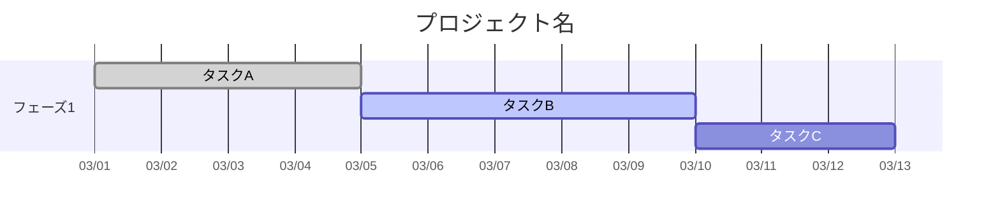
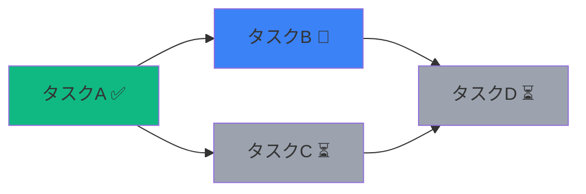

# Project Visualizer スキル

プロジェクトのタスク・進捗・スケジュール・依存関係を、複数のデータソースから取得し、**初めてプロジェクトに触れる人間でも一読で全体像と現状を把握できる**形式で可視化・ドキュメント化するスキル。

---

## 設計原則

このスキルで生成するすべての成果物は、以下の原則に従う。これらは個別ルールより優先される。

### 原則1: 初見理解性

成果物は「このプロジェクトを今日初めて知った人」が読者だと想定して構成する。上から順に読むだけで、プロジェクトの目的 → 全体構造 → 現在地 → 次のアクションが理解できるようにする。途中で別ページに飛ばないと文脈が掴めない構成にしない。

### 原則2: 視覚的コンパクトさ

どのページもスクロール距離が長くなりすぎないよう配慮する。目安としてPC画面3スクロール以内に収まることを意識する。長くなる場合は以下で対処する:
- トグル（折りたたみ）で詳細を隠す
- 図・チャートでテキストを置き換える
- 子ページに分離する（ただし原則3の制約内で）

テキストの羅列よりも、図解・表・ステータスバッジを優先する。

### 原則3: ページ構造の抑制（最大3層）

Notionページの階層は**最大3層まで**に抑える。

```
✅ 良い例（3層以内）:
プロジェクトHub
  ├── 設計図（概要・依存関係・ガント）
  ├── フェーズ1: 基盤構築
  │     ├── タスク詳細（トグル内に収容）
  │     └── 技術仕様（トグル内に収容）
  └── フェーズ2: 機能開発

❌ 悪い例（4層以上、ページ乱立）:
プロジェクトHub
  └── フェーズ1
        └── バックエンド
              └── API設計
                    └── エンドポイント一覧  ← 深すぎる
```

新たなページを作る前に必ず以下を確認する:
- 既存ページのトグル内に収容できないか？
- 類似の概念を持つ既存ページに統合できないか？
- 同じ粒度の兄弟ページとして並べられないか？

「ページを作る」より「既存ページを豊かにする」を優先する。

### 原則4: 整合性の維持

作業完了時には、変更した当該ページだけでなく、**影響を受ける可能性のある関連ページ**もチェックして最新状態を保つ。

```
チェック対象:
- プロジェクト設計図（ガント・依存関係図に変更が反映されているか）
- 親ページのサマリー情報（子の進捗が反映されているか）
- 関連タスクのステータス（依存先タスクの状態変化）
- 日付・担当者の整合性
```

Notion更新後、影響範囲の確認結果をユーザーに報告する。「〇〇ページも更新しました」「△△ページは変更不要でした」のように明示する。

---

## プロジェクト管理書の標準構成

Notionでプロジェクト管理書を作成・更新する際は、以下の構成を基本とする。ユーザーの指定がない場合はこの構成に従い、既存のプロジェクトページがある場合はその構造を尊重しつつ、この構成を参考に不足を補う。

### 推奨ページ構成

```
📋 プロジェクト設計図（トップページ）
│
│  [プロジェクトの目的・背景]
│    なぜこのプロジェクトが存在するか、1-3文で。
│
│  [全体像: 依存関係図]
│    Mermaidまたは図で、要素間の関係を一目で示す。
│    初見の人間がプロジェクトの構造を直感的に掴むための図。
│
│  [現在の進捗: ガントチャート]
│    今どこにいるか。進行中タスクをハイライト。
│    今日の位置に赤線。遅延があれば赤色で目立たせる。
│
│  [リスクとボトルネック]
│    今後発生しうる問題と、その対処方針の概略。
│    トグル内に詳細を格納。表面には要点のみ。
│
│  ▶ トグル: 要素詳細
│    各フェーズ・モジュールの説明を折りたたみで格納。
│    タスクレベルの詳細はここに含める。
│
├── 📊 進捗ダッシュボード（子ページ1）
│    サマリーカード、ステータス分布、担当者負荷、遅延一覧
│    ReactアーティファクトまたはNotion内テーブル+数式
│
└── 📁 リソース・参考資料（子ページ2）
     技術仕様、外部リンク、議事録など
     ここもトグルで整理し、フラットに保つ
```

### 構成の適用ルール

- **新規プロジェクト**: この構成でゼロから作成する
- **既存プロジェクトへの追加**: 既存構造を壊さず、不足している要素（ガント、依存関係図、リスク欄など）を補完する
- **小規模プロジェクト（タスク10個以下）**: 子ページを作らず、トップページ1枚にトグルで全て収容する
- **大規模プロジェクト（タスク50個超）**: フェーズごとに子ページを設けてよいが、3層を超えない

---

## データ取得

### Notion（最優先ソース）

Notion MCPツールを使ってタスクデータを取得する。

```
取得手順:
1. notion-search でプロジェクトのデータベースを特定
2. notion-fetch または notion-query-database-view でタスク一覧を取得
3. 各タスクから以下のフィールドをマッピング:
   - タスク名（Title）
   - ステータス（Status / Select）
   - 担当者（Person）
   - 開始日・期限（Date）
   - 優先度（Select / Number）
   - 依存関係（Relation）
   - 進捗率（Number / Formula）
   - カテゴリ・タグ（Multi-select）
```

ユーザーがデータベース名やURLを指定しない場合は `notion-search` で候補を検索して確認を取る。フィールド名はデータベースによって異なるため、取得後に中身を確認し柔軟にマッピングする。

### CSV / JSON ファイル

アップロードされたファイル、または指定パスから読み込む。

```
必須カラム（推奨名、別名も柔軟に対応）:
- task_name / タスク名 / title
- status / ステータス
- start_date / 開始日
- due_date / 期限 / end_date

任意カラム:
- assignee / 担当者
- progress / 進捗率（0-100）
- depends_on / 依存先（タスクIDやタスク名のカンマ区切り）
- priority / 優先度
- milestone / マイルストーン
```

カラム名が異なる場合は内容から推測してマッピングする。推測に自信がない場合はユーザーに確認する。

### GitHub Issues（補助ソース）

ユーザーが明示的に要求した場合のみ使用。GitHub APIやMCPツールがあればそれを利用し、なければCSVエクスポートを依頼する。

---

## データ正規化

取得したデータを統一フォーマットに変換する。どのソースでも同じ可視化パイプラインで処理するため。

```json
{
  "project": {
    "name": "プロジェクト名",
    "updated_at": "2026-03-03T00:00:00+09:00"
  },
  "tasks": [
    {
      "id": "task-001",
      "name": "タスク名",
      "status": "進行中",
      "assignee": "担当者名",
      "start_date": "2026-03-01",
      "due_date": "2026-03-15",
      "progress": 60,
      "priority": "高",
      "depends_on": ["task-000"],
      "tags": ["開発", "バックエンド"],
      "milestone": "v1.0リリース"
    }
  ]
}
```

### ステータスの正規化

| 正規化ステータス | 対応する値の例 |
|---|---|
| `未着手` | Not Started, Todo, Backlog, 未対応 |
| `進行中` | In Progress, Doing, 対応中, 作業中 |
| `レビュー中` | In Review, 確認待ち, テスト中 |
| `完了` | Done, Completed, 完了, Closed |

上記に当てはまらないステータスは意味から判断して振り分ける。判断が難しい場合はそのまま保持する。

---

## 可視化の生成

### ガントチャート（タイムライン）

**Mermaid形式** — タスク20個以下、依存関係が単純な場合:



**React アーティファクト** — タスク多数、フィルタリング・インタラクション必要な場合:
- 横軸: 日付（週/月ズーム）、縦軸: タスク（グループ化・ソート可）
- バー色: 未着手=グレー、進行中=ブルー、レビュー=オレンジ、完了=グリーン
- 依存矢印、今日線（赤）、遅延ハイライト
- Tailwind CSS + recharts/d3

### 進捗ダッシュボード

Reactアーティファクトで生成。含める要素:
- サマリーカード（総タスク数、完了率、遅延数、今週期限数）
- ステータス分布（ドーナツチャート）
- 担当者別負荷（棒グラフ）
- 遅延タスク一覧（赤色ハイライト付きテーブル）
- マイルストーン進捗バー

### 依存関係図

**Mermaid形式:**


5階層以上の深い依存関係がある場合はReactで力指向グラフの生成も検討する。

---

## 出力・配信

### Notion 更新

Notion MCPツールで可視化結果を反映する。

**更新パターン:**
- 既存ページへの追記 → `notion-update-page`
- 新規ページ作成 → `notion-create-pages`（原則3を厳守: 本当に新ページが必要か確認）
- データベースの更新 → `notion-update-data-source`

**Notionに書き込む内容:**
- テキストサマリー（進捗率、遅延状況、次のマイルストーン）
- Mermaidダイアグラム（コードブロック挿入）
- 更新日時の明記

**必須手順:**
1. 更新内容をユーザーに提示し承認を得る（上書き防止）
2. 更新を実行する
3. **影響範囲チェック**を実行する（原則4）:
   - 当該ページの親ページのサマリーは最新か？
   - 依存関係にあるタスクのステータスは整合しているか？
   - プロジェクト設計図のガント・依存関係図は反映済みか？
4. チェック結果をユーザーに報告する

**運用制約（厳守）:**
- **Notionはブラウザ操作で更新しない。** 必ずNotion MCPツール（notion-update-page, notion-create-pages等）を使用する。ブラウザ自動操作（Claude in Chrome等）によるNotion編集は禁止。
- **BUILDERタスクキューはパッケージ化しない。** タスクキューDBはボードビューで表示し、個々のタスクとして管理する。BUILDERへの実行指示は #aix-dev Slackチャンネルで行う（ワークパッケージページの作成は不要）。

### Google ドキュメント / スプレッドシート

**スプレッドシート出力（.xlsx）:**
xlsxスキルの手法に従い以下を含む:
- タスク一覧シート（フィルタ付きテーブル）
- サマリーシート（KPI、グラフ）
- ガントチャートシート（条件付き書式でバー表現）

**ドキュメント出力（.docx）:**
docxスキルの手法に従い、プロジェクト管理書の標準構成と同じ読み順で構成する:
1. 目的・背景
2. 全体像（依存関係図）
3. 現在の進捗（ガント）
4. リスク・ボトルネック
5. 要素詳細
6. 次のアクション

### Reactアーティファクト

ダッシュボード・インタラクティブガントチャートは `.jsx` で出力する。frontend-designスキルの美学ガイドラインに従い、プロフェッショナルな仕上がりにする。

---

## 判断ガイドライン

| ユーザーの指示 | 推奨アクション |
|---|---|
| 「進捗見せて」 | Notionからデータ取得 → 進捗ダッシュボード（React） |
| 「ガントチャート作って」 | データ取得 → タスク数に応じてMermaid or React |
| 「プロジェクト管理書を作って」 | 標準構成に従いNotion上にプロジェクト設計図を構築 |
| 「スケジュールを整理して」 | ガントチャート + 遅延タスク一覧 |
| 「レポートにまとめて」 | Google Docs/xlsxで出力 |
| 「Notionを更新して」 | データ整理 → Notion更新 → 影響範囲チェック |
| 「依存関係を見たい」 | Mermaid依存関係図 |
| データソース不明 | まずNotionを検索、なければファイル要求 |

---

## ドキュメント管理ルール（厳守）

### 仕様書を唯一の正とする（Single Source of Truth）
修正ログを判断の基準にせず、仕様書自体を最新の状態に更新しながら作業を進める。仕様書を読み込めば、いつも最新版の正しいアウトプットが出せる状態を常に維持する。

### 成果物をNotionに残す
モックやプロトタイプ、本番プログラム等について、どの環境から作業しても最新の成果物がいつでも確認できるようにNotion上に最新版のコードを残す。

### 情報の鮮度を管理する
変更のあったルールや情報を放置せず、常にどの情報が最新か判断できるように管理する。古い記述が残ったまま新しい情報が別の場所に追加される状態を許容しない。

---

## 注意事項

- **データ取得失敗時**: ソースにアクセスできない場合はCSV/JSON形式でのデータ提供を依頼する
- **大量データ（100タスク超）**: フィルタリング（期間・担当者・ステータス）を提案する
- **日付**: JST（Asia/Tokyo）基本。ISO 8601形式で内部処理する
- **プライバシー**: タスクデータに機密情報が含まれる可能性があるため、外部サービスへの不要な送信は行わない
- **他スキルとの連携**: xlsx出力→xlsxスキル、docx出力→docxスキル、React生成→frontend-designスキルを参照
